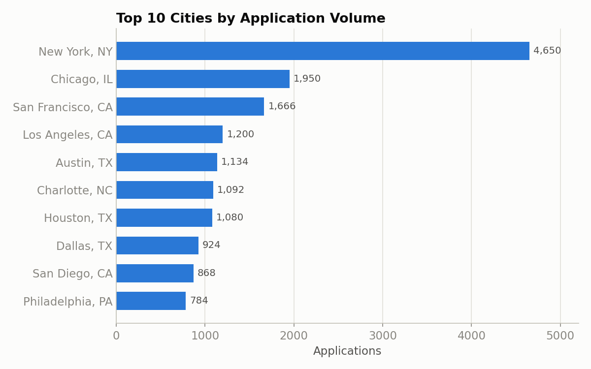
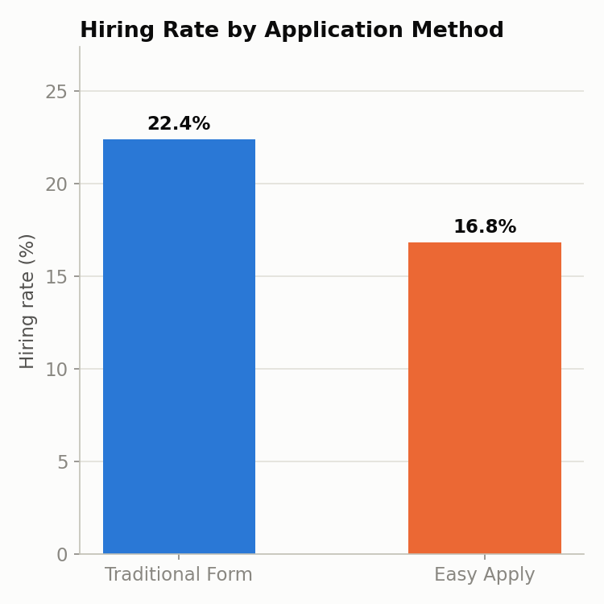
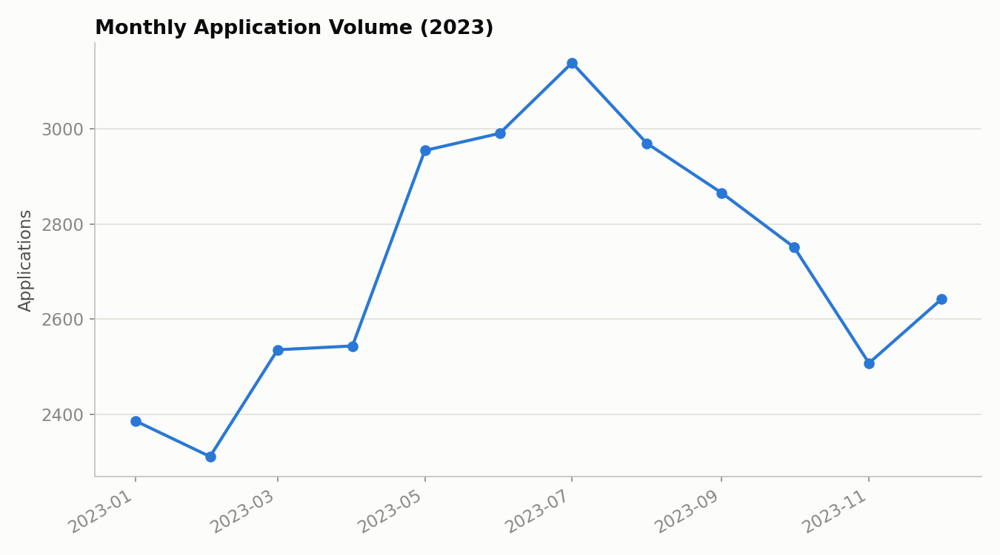
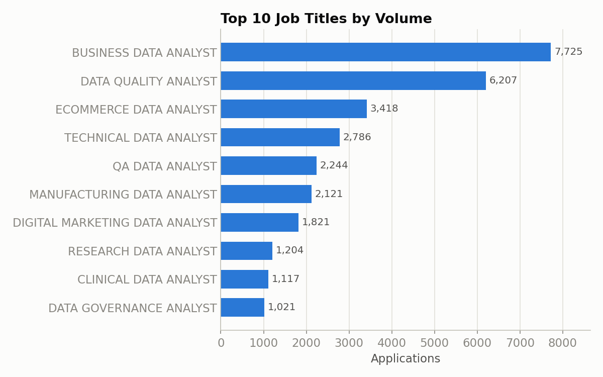

# 🏢 Corporate Recruitment & Job Application Analytics Dashboard

Power BI + Azure Maps dashboard over a year of raw job applications (`data/job_application.xlsx`, 32,596 rows), tracking pipeline volume, hiring rate, and application-channel friction. `generate_charts.py` builds a static matplotlib preview of the same data for anyone browsing without opening the `.pbix`.

## 📊 Power BI Report
*Open `dashboard/job-application-data.pbix` in Power BI Desktop for the full interactive report, including the Azure Maps geographic view.*


**DAX measures:**
- `Total Applications = COUNT(raw[ID])`
- `Total Hires = CALCULATE(COUNT(raw[ID]), raw[Hired] = TRUE)`
- `Hiring Rate % = Total Hires / Total Applications * 100`

## 📈 Static Preview (matplotlib)
Run `python generate_charts.py` to regenerate these from `data/job_application.xlsx`.






## 🗂️ Data Prep
`Job Location` strings (e.g. `"New York, NY"`) are split into city/state via Power Query for the Azure Maps visual; trailing whitespace is trimmed so the geocoder resolves cleanly.

## 📂 Structure
```
dashboard/
  job-application-data.pbix   full interactive report
  *.png                       chart exports (Power BI + matplotlib)
data/job_application.xlsx     raw source
generate_charts.py            matplotlib preview pipeline
```
