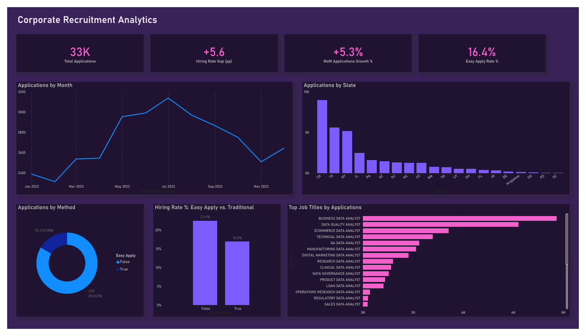

# 🏢 Corporate Recruitment & Job Application Analytics Dashboard

Power BI dashboard over a year of raw job applications (`data/job_application.xlsx`, 32,596 rows), tracking pipeline volume, hiring rate, and application-channel friction.

## 🖥️ The Dashboard

`job-application-data.pbip` (open with Power BI Desktop — File → Open → the
`.pbip` file; it pulls straight from `data/job_application.xlsx`). Single
dark purple/pink dashboard page, Bahnschrift throughout.



A static export (`job-application-data.png`) lives alongside the `.pbip`
for anyone without Power BI Desktop. The original interactive report with
the Azure Maps geographic view (`dashboard/job-application-data.pbix`) is
still available for opening directly in Desktop.

**KPI strip:** Total Applications, Hiring Rate Gap (pp) — the spread
between Easy Apply and traditional hiring rates — MoM Applications Growth
%, and Easy Apply Rate %, so the headline volume number always sits next
to comparative context instead of standing alone. Below that: applications
by month, applications by state, an Easy Apply vs. traditional
applications split, and top job titles by application count.

**Key DAX measures:**
- `Total Applications = COUNT(raw[ID])`
- `Hiring Rate % = DIVIDE([Total Hires], [Total Applications], 0)`
- `Hiring Rate Gap (pp) = ([Traditional Hiring Rate %] - [Easy Apply Hiring Rate %]) * 100`
- `MoM Applications Growth %` — current vs. prior calendar month, independent of any visual-level filters

## 🗂️ Data Prep
`Job Location` strings (e.g. `"New York, NY"`) are split into city/state via Power Query for the Azure Maps visual; trailing whitespace is trimmed so the geocoder resolves cleanly.

## 📂 Structure
```
dashboard/job-application-data.pbix   original interactive report (Azure Maps view)
data/job_application.xlsx             raw source
job-application-data.pbip             Power BI project (open in Desktop)
job-application-data.Report/          PBIR: pages, visuals as JSON
job-application-data.SemanticModel/   TMDL: tables, measures
job-application-data.png              static export of the dashboard
```
