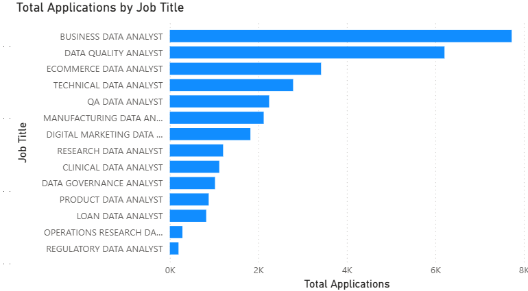
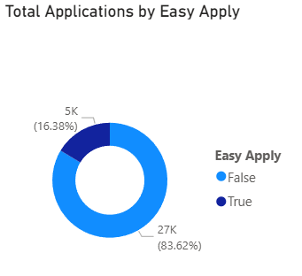

# 🏢 Corporate Recruitment & Job Application Analytics Dashboard

An interactive end-to-end Business Intelligence project built using **Power BI Desktop** and **Azure Maps cloud routing**. This repository transforms a raw, transactional applicant ledger into an executive-level HR dashboard that dynamically tracks geographic demand velocity, calculates pipeline metrics, and evaluates channel application friction.

---

## 📊 Live Interactive Dashboard Interface

Below are the active modules engineered within the Power BI reporting canvas:

### 1. Executive Performance Scorecard
*High-level strategic metrics capturing total throughput and pipeline volume.* 

### 2. Application Process Friction (Easy Apply Rates)
*Analyzing candidate behavior based on platform submission features (One-Click Easy Apply vs. Traditional Forms).* 

---

## 🗂️ Data Framework & Metrics Definition

The analysis uses historical event logs extracted from the raw data sheet inside the source workbook. To power the background evaluation matrix, the data model implements custom **DAX (Data Analysis Expressions)** measures:

* **Total Active Pipeline:** Calculates total incoming applicant volume across all fields:
  $$\text{Total Applications} = \text{COUNT}(\text{raw}[\text{ID}])$$
* **Successful Placements:** Filters and subsets volume where final contract thresholds are met:
  $$\text{Total Hires} = \text{CALCULATE}(\text{COUNT}(\text{raw}[\text{ID}]), \text{raw}[\text{Hired}] = \text{TRUE})$$
* **Conversion Efficiency:** Determines the percentage velocity of applications converting into finalized hires:
  $$\text{Hiring Rate \%} = \frac{\text{Total Hires}}{\text{Total Applications}} \times 100$$

---

## 🛠️ Data Engineering & Geocoding Architecture

To bypass geographic rendering issues common with raw unstructured text data, this project implements a rigorous data preparation pipeline:
1. **Power Query String Parsing:** Combined address strings (e.g., `"New York, NY"`) are split using comma delimiters to isolate explicit city and state names.
2. **Attribute Trimming (`Text.Trim`):** Applied text formatting inside the ETL pipeline to strip hidden trailing white spaces that freeze standard mapping engines.
3. **Azure Cloud Integration:** Spatial metrics are fed directly into the cloud-connected Azure Map visual layer, forcing exact coordinate resolution across the continental United States.

---

## 📂 Repository Tree Structure
```text
job-application-recruitment-dashboard/
├── dashboard/
│   ├── total_applications.png        
│   ├── easy_apply_rate.png           
│   └── Recruitment_Analytics.pbix    
├── data/
│   └── job_application.xlsx          
├── .gitignore                    
└── README.md                     
